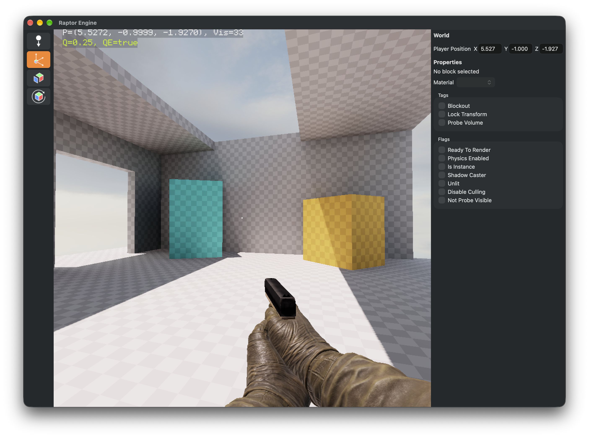
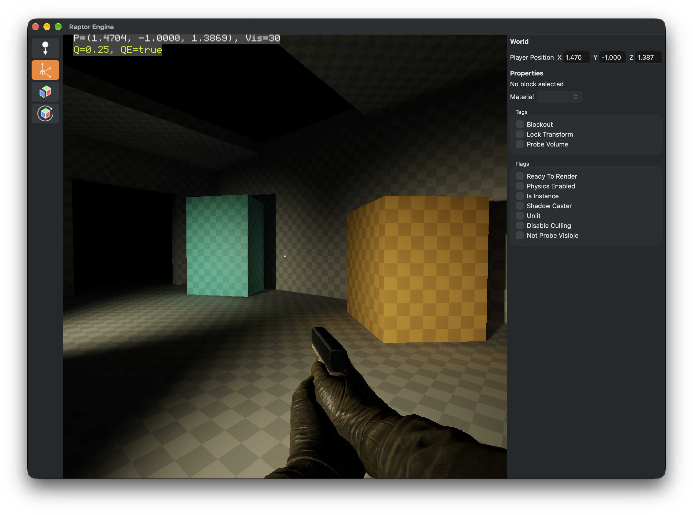

Raptor is a 3D game engine being developed for an experimental game.

## Screenshots

|          Global Illumination (Bright)          |       Global Illumination (Dark)        |
| :--------------------------------------------: | :-------------------------------------: |
|  |  |

## Features

- Tiled forward renderer (Forward+) with Vulkan
- Blockout editor for building prototype levels fast
- Baked light probe global illumination
- Fast math library using SIMD
    - Supports Arm NEON and AVX processors.

- Scripting with [Strata](https://github.com/StrataLanguage/stratac), compiled JIT
    - All in-game editor modes are written in Strata.
- Custom core library and containers
- Multithreaded and extensible asset manager that works seamlessly in the background
- Jolt Physics integration

## Docs

| Name               | Document                                |
| ------------------ | --------------------------------------- |
| Config format      | [ConfigFormat.md](Docs/ConfigFormat.md) |

## Building

Raptor is built with Cargo. The Rust workspace in `SrcRS/` is the entry point: `raptor-app` builds the remaining C++
engine as a static library through CMake (in `SrcRS/target/cmake/`) and links it into the `raptor` executable, so you
need Rust, CMake, Ninja, the Vulkan SDK, wxWidgets (for the editor), SDL3, freetype, turbojpeg, ktx and LLVM
installed.

### Building for MacOS

```
cd SrcRS

# Build Raptor. `--release` builds the C++ as RelWithDebInfo, without it as Debug.
# VULKAN_SDK is found in ~/VulkanSDK if it is not set.
cargo build --release -p raptor-app

# Run it from the repository root (or anywhere, assets are found through FX_BASE_DIR)
../SrcRS/target/release/raptor
```

Pass `--no-default-features` to leave out the editor. Set `RAPTOR_SKIP_CPP=1` to skip the C++ build, for example to
run `cargo check` or `cargo clippy` over the Rust crates only. `RAPTOR_CMAKE_CONFIG` overrides the CMake configuration.

## Platforms Supported

- Windows (x86_64)
- macOS (aarch64)
